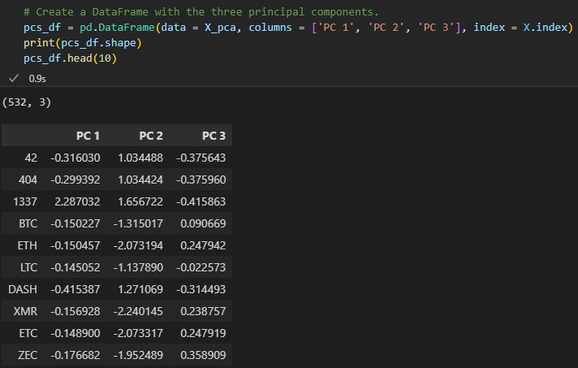

# Cryptocurrencies

# Overview of Project

The aim of this project is to use unsupervised machine learning specifically the K-means algorithm to analyze a database of cryptocurrencies and create a report based on traded cryptocurrencies classified by group according to their features. The (PCA) process commonly known as the principal component analysis will be is to speed up the process.

Deliverable Objectives

- Objective 1: Preprocessing the Data for PCA

- Objective 2: Reducing Data Dimensions Using PCA

- Objective 3: Clustering Cryptocurrencies Using K-means

- Objective 4: Visualizing Cryptocurrencies Results

## Resources

- Data Source: crypto_data.csv

- Data Tools: crypto_clustering_starter_code.ipynb.

- Software: Python 3.7.6, Visual Studio
 
- Libraries: SKLearn/Scikit-learn, Pandas, Plotly, Maptplotlib, hvPlot

- Environment: Python 3.7

- Unsupervised Machine Learning and Cryptocurrencies

- Using Unsupervised Learning to Discover Unknown Patterns

# Results:

There were five hundred and thirty-two (532) tradable cryptocurrencies.

## Objective 1: Preprocessing the Data for PCA

Below is a snippet of the DataFrame  after the fit and transforming

## Objective 2: Reducing Data Dimensions Using PCA

PCA is statistical technique to speed up machine learning algorithms when the number of input features (or dimensions) is too high. PCA reduces the number of dimensions by transforming a large set of variables into a smaller one that contains information in the original large set. 

The first step in PCA is to standardize these features by using the StandardScaler library. Below is a snippet of the results 

## Objective 3: Clustering Cryptocurrencies Using K-means

Clustering groups data points together. K-means on the other hand stores $k$ centroids that it uses to define clusters. A point is in a particular cluster if it is closer to that cluster's centroid than any other centroid.

K-Means finds the best centroids by alternating between (1) assigning data points to clusters based on the current centroids (2) choosing centroids (points which are the center of a cluster) based on the current assignment of data points to clusters

Finally, Elbow Curve is a method for determining the best number for K-means. Inertia is one of the most common objective functions to use when creating an elbow curve. The inertia is measuring the amount of variation in the dataset. The inertia measuring the amount of variation in the dataset. Inertia is the objective function to plot K values against.

Below is a snippet of the elbow curve shows K = 4 as the initial point:
 
 MinMaxScaler().fit_transform method to scale the "TotalCoinSupply" and "TotalCoinsMined" columns:

### 3D scatter plot using the Plotly Express scatter_3d():

